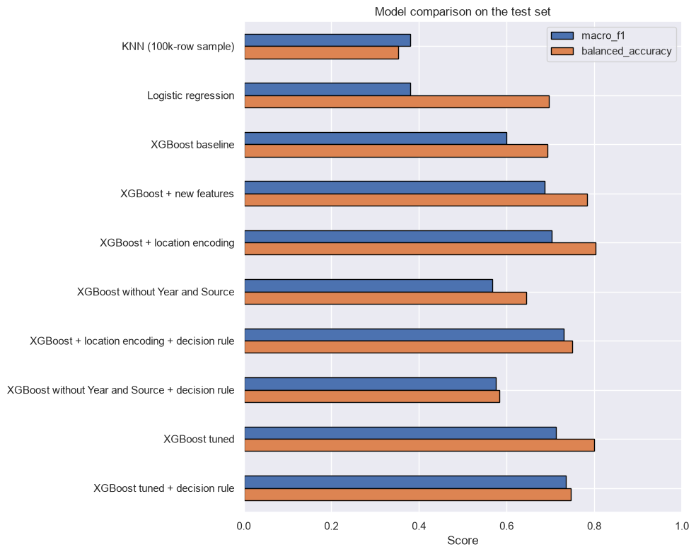
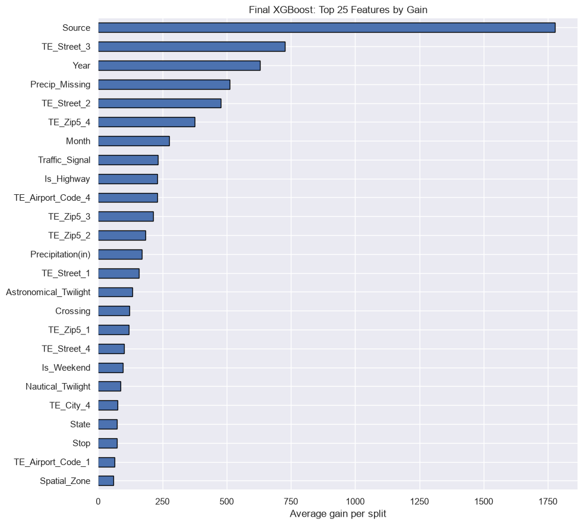
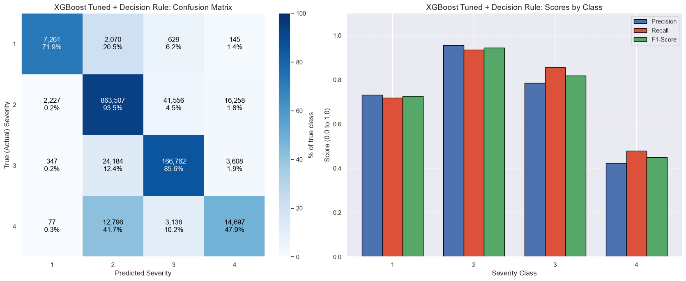

# US Accidents: Predicting Accident Severity

[View the full notebook on nbviewer](https://nbviewer.org/github/Atharva-Penkar/US-accidents-severity-analysis-and-prediction/blob/main/analysis.ipynb)

Predicting the severity of a road accident (1 = least impact on traffic, 4 = most) from its time, location, weather and road features, using 7.7 million US accident records.

The project compares K-Nearest Neighbours, Logistic Regression and XGBoost, then improves XGBoost step by step. It also tests how much of the score comes from the way severity was recorded instead of from the accident itself.

## Results

All scores are on a held-out test set of 1,159,260 accidents (KNN was scored on a 10,000-row sample of it).

| Model | Accuracy | Macro F1 | Balanced accuracy |
| --- | --- | --- | --- |
| KNN (100k-row sample) | 0.824 | 0.381 | 0.352 |
| Logistic regression | 0.538 | 0.379 | 0.697 |
| XGBoost baseline | 0.856 | 0.599 | 0.693 |
| XGBoost + new features | 0.880 | 0.687 | 0.784 |
| XGBoost + location encoding | 0.895 | 0.702 | 0.803 |
| XGBoost + location encoding + decision rule | 0.907 | 0.730 | 0.750 |
| XGBoost tuned | 0.898 | 0.713 | 0.800 |
| **XGBoost tuned + decision rule** | **0.908** | **0.735** | **0.747** |
| XGBoost without `Year` and `Source` | 0.829 | 0.567 | 0.644 |
| XGBoost without `Year` and `Source` + decision rule | 0.846 | 0.575 | 0.583 |



### Key findings

- **XGBoost clearly beats the simpler models.** Macro F1 rises from about 0.38 (KNN, logistic regression) to 0.60 for the XGBoost baseline.
- **Feature work added more than tuning.** New features and location encoding lifted macro F1 from 0.599 to 0.702. The hyperparameter search added about 0.01.
- **Much of the score depends on how severity was recorded.** Removing `Year` and `Source` drops macro F1 from 0.702 to 0.567. The best score without them is 0.575, which is the realistic figure for a new data provider or a future year.
- **Severity 4 is the hardest class.** The final model finds 48% of the most severe accidents; 42% of them are predicted as Severity 2.

## Why `Year` and `Source` matter

`Source` is the data provider that reported the accident and `Year` is when it happened. Neither describes the accident, yet `Source` is the single most important feature in the final model and `Year` is the third.

The reason is visible in the data. The share of each severity class differs sharply by provider and by year:

| Source | Sev 1 | Sev 2 | Sev 3 | Sev 4 |
| --- | --- | --- | --- | --- |
| Source1 | 0.7% | 91.2% | 3.7% | 4.4% |
| Source2 | 1.1% | 65.0% | 33.5% | 0.4% |
| Source3 | 4.2% | 64.1% | 31.6% | 0.2% |

| Year | Sev 1 | Sev 2 | Sev 3 | Sev 4 |
| --- | --- | --- | --- | --- |
| 2016 | 0.1% | 65.7% | 30.7% | 3.5% |
| 2019 | 0.0% | 72.1% | 24.9% | 2.9% |
| 2021 | 0.0% | 88.5% | 9.5% | 2.0% |
| 2023 | 0.0% | 97.1% | 0.0% | 2.9% |

Severity 3 falls from about 31% of accidents in 2016 to none in 2023. A model given these two columns can score well by learning the recording process. For that reason the notebook reports results both with and without them.



## Dataset

[US Accidents (2016 - 2023)](https://www.kaggle.com/datasets/sobhanmoosavi/us-accidents) by Sobhan Moosavi, from Kaggle.

- 7,728,394 accidents and 46 columns, 2016 to March 2023
- Target: `Severity`, with very unbalanced classes

| Severity | Accidents | Share |
| --- | --- | --- |
| 1 | 67,366 | 0.87% |
| 2 | 6,156,981 | 79.67% |
| 3 | 1,299,337 | 16.81% |
| 4 | 204,710 | 2.65% |

The CSV is about 3 GB and is not included in this repository. Download `US_Accidents_March23.csv` from Kaggle and place it next to the notebook. Check the Kaggle page for the dataset's licence and citation requirements before reusing the data.

## Method

1. **Exploration.** Missing values, correlations, class balance, and severity by hour, weekday and month.
2. **Data quality fix.** `Start_Time` is stored in two formats; 743,166 rows (9.6%) carry fractional seconds and would be lost by a naive parse. They are parsed with `format='ISO8601'`.
3. **Column removal.** Duplicated columns (`End_Lat`, `End_Lng`, `Wind_Chill(F)`), columns only known after the accident (`End_Time`, `Distance(mi)`), eight near-constant columns, and identifiers (`ID`, `Weather_Timestamp`).
4. **Location feature.** HDBSCAN on a 100,000-point sample finds 48 dense urban hotspots; every accident is assigned to a hotspot or labelled rural.
5. **Split.** 70% train, 15% validation, 15% test, stratified by severity.
6. **Class imbalance.** Class weights in training, and macro F1 and balanced accuracy for scoring.
7. **Models.** KNN and logistic regression on samples as baselines, then XGBoost on the full training set (GPU).
8. **XGBoost improvements.**
   - New features: coordinates, year, weekend flag, highway flag from the street name, missing-precipitation flag.
   - Target encoding of street, city, county, ZIP code and airport, with 5-fold cross-fitting to avoid leakage.
   - A check that retrains without `Year` and `Source`.
   - Per-class probability multipliers tuned on the validation set for macro F1.
   - A 12-trial random search over tree settings, then a final model at a lower learning rate.

## Final model in detail



| Severity | Precision | Recall | F1 |
| --- | --- | --- | --- |
| 1 | 0.733 | 0.719 | 0.726 |
| 2 | 0.957 | 0.935 | 0.946 |
| 3 | 0.786 | 0.856 | 0.820 |
| 4 | 0.423 | 0.479 | 0.449 |

## Limitations

- **Random split.** Accidents from the same period and place appear in both training and test data. Training on earlier years and testing on later ones would be a stricter test.
- **Recording effects.** The headline score of 0.735 uses `Year` and `Source`. Without them the best score is 0.575.
- **Sampled baselines.** KNN was trained on 100,000 rows and logistic regression on 1 million rows to keep run time reasonable. Logistic regression reached its iteration limit without fully converging.
- **Validation set reuse.** It was used for early stopping, the decision rule and the settings search. The test set was used only for final scores.
- **Unused data.** The free-text accident description is not used.

## Repository contents

```
analysis.ipynb      Full analysis, with outputs
README.md
requirements.txt
images/             Charts used in this README
```

## How to run

1. Install Python 3.13 or later and create a virtual environment.
2. Install the packages:

   ```
   pip install -r requirements.txt
   ```

3. Download `US_Accidents_March23.csv` from Kaggle into the repository folder.
4. Open `analysis.ipynb` and run all cells.

The analysis was run on a laptop with 32 GB of RAM; the full dataset is held in memory, so much less may not be enough. XGBoost uses an NVIDIA GPU if one is available and falls back to CPU otherwise. With an RTX 4060, each XGBoost model trained in 1.5 to 5 minutes.

### Requirements

```
pandas>=2.2.3
numpy>=2.1.0
scipy>=1.14.1
matplotlib>=3.9.2
seaborn>=0.13.2
scikit-learn>=1.9.0
xgboost>=3.0.0
jupyter>=1.1.1
ipykernel>=6.29.5
pyarrow>=18.0.0
```

Results above were produced with Python 3.13, pandas 3, scikit-learn 1.9 or later, and XGBoost 3.4.1.
